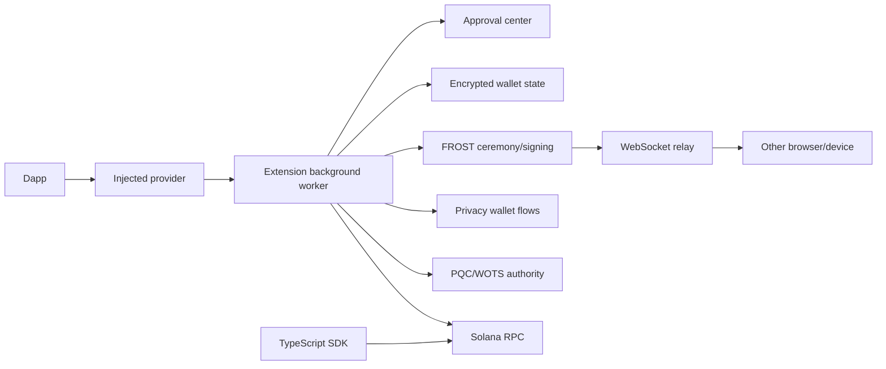
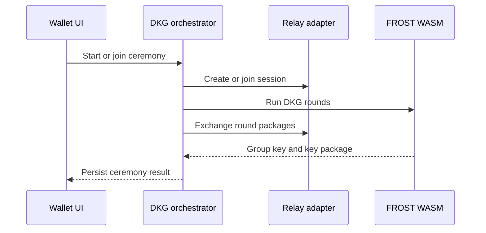
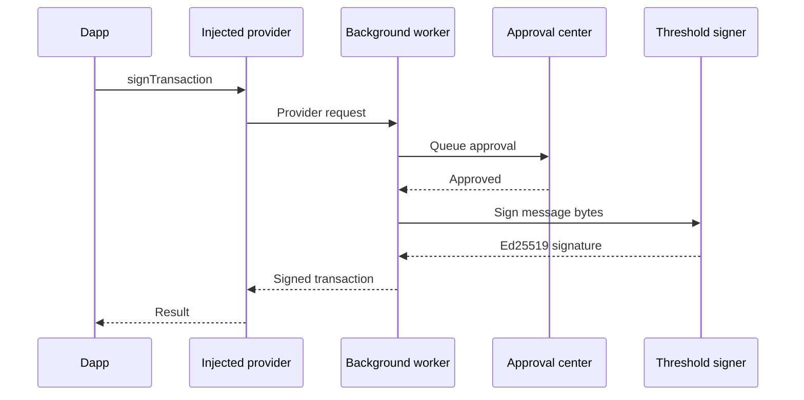

# Vaulkyrie Browser Wallet

Vaulkyrie Browser Wallet is the extension and browser SDK side of the Vaulkyrie wallet suite. It provides the React extension UI, dapp provider injection, approval flow, FROST DKG/signing orchestration, relay-backed multi-device ceremonies, privacy wallet flows, and browser-side post-quantum authority UX.

> **Early-stage software:** this repository has not completed a formal third-party security audit. Treat it as development software, use devnet/test funds only, and do not rely on it for production custody until audits, release hardening, hosted infrastructure, and package publishing are complete.

## What This Repository Contains



| Path | Purpose |
| --- | --- |
| `src/background` | Extension background worker, provider request handling, approvals, and wallet sessions. |
| `src/content` | Content script bridge between web pages and the extension. |
| `src/injected` | Dapp-facing provider injected into web pages. |
| `src/components` | Wallet, ceremony, settings, onboarding, approval, and vault UI components. |
| `src/services/frost` | Browser FROST DKG and threshold signing orchestration. |
| `src/services/relay` | Local and WebSocket relay adapters used for cross-device ceremonies. |
| `src/services/quantum` | WOTS/XMSS/Winternitz-style authority logic and persisted PQC wallet state. |
| `src/services/umbra` | Privacy wallet integration layer. |
| `src/sdk` | In-app TypeScript instruction/account/client helpers. |
| `packages/vaulkyrie-sdk` | Publishable `@vaulkyrie/sdk` workspace package built from the browser SDK helpers. |
| `relay-server` | Node WebSocket relay service for multi-device DKG/signing and optional cosigner APIs. |

## Setup

```bash
npm install
```

Run the extension in development:

```bash
npm run dev
```

Build and lint:

```bash
npm run build
npm run lint
```

## Relay Server

Development relay:

```bash
cd relay-server
npm install
npm run build
npm run dev
```

Local development defaults to:

```bash
ws://localhost:8765
```

Packaged extension builds default to the hosted secure relay endpoint:

```bash
wss://relay.vaulkyrie.xyz
```

You can override the relay at build time:

```bash
VITE_RELAY_URL=wss://relay.vaulkyrie.xyz npm run build
```

Chrome extensions cannot start or bundle a persistent Node relay server. Production cross-browser and cross-device ceremonies require a deployed WebSocket relay with TLS, stable DNS, logging, rate limits, and operational monitoring. The extension manifest allows the hosted Vaulkyrie relay and keeps localhost support for development.

## TypeScript SDK

Build the browser-oriented SDK package:

```bash
npm run build:sdk
```

Create a local npm tarball for testing:

```bash
npm run pack:sdk
```

After the package is published, developers should be able to install it with:

```bash
npm install @vaulkyrie/sdk @solana/web3.js
```

Example:

```ts
import { VaulkyrieClient, findVaultRegistryPda } from "@vaulkyrie/sdk";
import { Connection, PublicKey } from "@solana/web3.js";

const connection = new Connection("https://api.devnet.solana.com", "confirmed");
const wallet = new PublicKey("11111111111111111111111111111111");
const [vaultRegistry] = findVaultRegistryPda(wallet);

const client = new VaulkyrieClient(connection);
const result = await client.getVaultRegistry(wallet);
console.log(vaultRegistry.toBase58(), result?.account.status);
```

Before publishing to npm:

1. Verify `npm run build:sdk` passes.
2. Verify `npm pack -w @vaulkyrie/sdk` contains only `dist` and package metadata.
3. Reserve or configure the `@vaulkyrie` npm organization.
4. Publish with `npm publish -w @vaulkyrie/sdk --access public`.
5. Tag the release and update the Mintlify SDK page with the final version.

## Extension Release Path

```bash
npm install
VITE_RELAY_URL=wss://relay.vaulkyrie.xyz npm run build
```

Upload the generated extension output to the Chrome Web Store after manual QA. Before submission, confirm:

- The production relay is deployed and reachable over `wss://`.
- DKG create/join flows work across two browsers or devices.
- Dapp connection and signing approval flows work from a test dapp.
- Devnet transactions settle successfully.
- Privacy and PQC flows are marked accurately if they remain experimental.

## Key Flows

### Multi-Device DKG



### Dapp Signing



## Official Links

- Website: https://www.vaulkyrie.xyz/
- Documentation: https://vaulkyrie.mintlify.app/
- GitHub: https://github.com/Vaulkyrie
- X: https://x.com/vaulkyrie_hq
